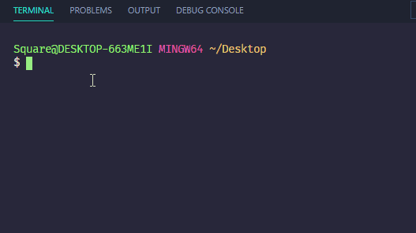

# ActivityCopyScript
A bash script to grab your activities, put them in a new directory, and then zip it so you can slack it out to your students!
### CONFIGURE
Make sure to edit the script to point to **your** specific fullstack-ground/01-class-content directory! It is currently set for my own. You may also need to set up 7zip in your envoirment variables so that bash can use the 7z command in the script!
### The Command Line
To invoke the script open up your terminal of choice, then type in the name of the script (I won't get mad if you change the name), and enter in your three arguments.

### Week
Enter in any week number you are on ie. week 17 would be 17. The script will go check your 01-Class-Content directory for any subdirectory that matches 17. If you put in 2 for week two don't worry! I have formatted the argument to be a leading zero to match with the naming scheme!
### New Directory Name
The second argument you put in will be your new directory name. I prefer to use the _week#Day#_ format; it helps me and the students compartmentalize everything neatly!
### Range Start and End
The third and fourth arguments will be your range. If the lesson plan calls for lessons 01 02 03 04 05 06 07 you can just write 1 7. Don't worry here either, I have set it for leading 0s, or you can type them out if you wish too.
### Finale!
Once you have all of your arguments in and hit enter, the script will run through the week number directory, make a new directory (week#Day#) and save the class activities into that folder *WHILE* also removing all "Solved" folders as well! It will keep the unsolved for the students to work on! Then it zips that directory up and creates a new archive in the same location as week#Day#.zip and you are ready to slack it out!

